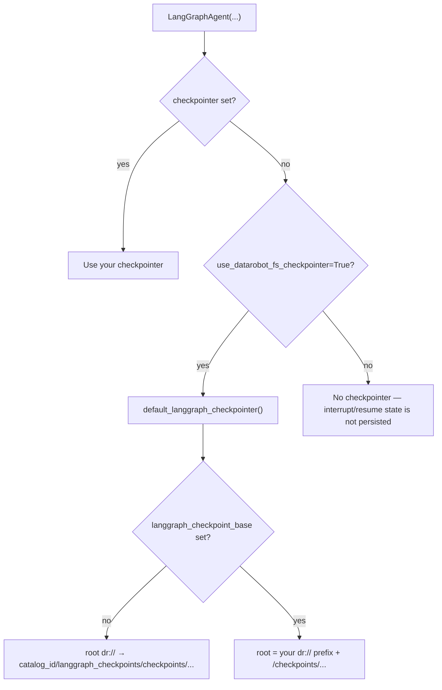
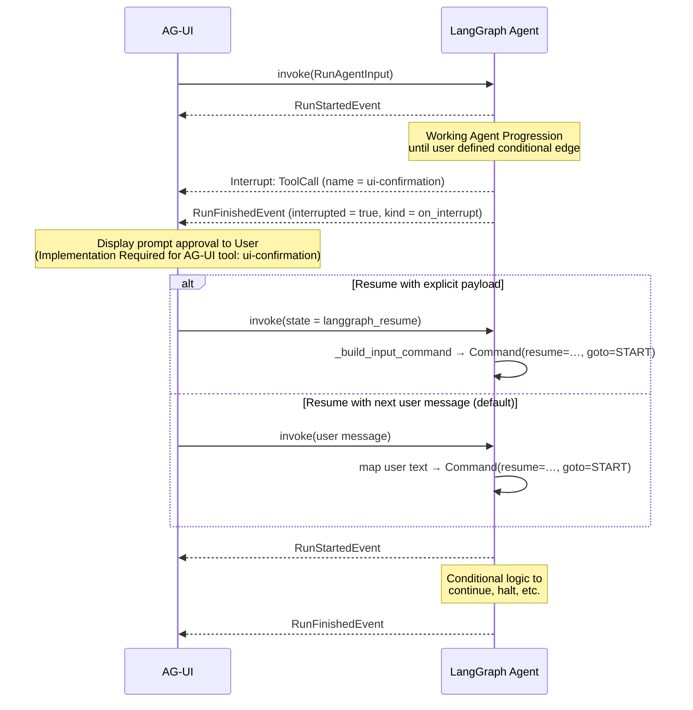

<!--
  ~ Copyright 2026 DataRobot, Inc. and its affiliates.
  ~
  ~ Licensed under the Apache License, Version 2.0 (the "License");
  ~ you may not use this file except in compliance with the License.
  ~ You may obtain a copy of the License at
  ~
  ~     http://www.apache.org/licenses/LICENSE-2.0
  ~
  ~ Unless required by applicable law or agreed to in writing, software
  ~ distributed under the License is distributed on an "AS IS" BASIS,
  ~ WITHOUT WARRANTIES OR CONDITIONS OF ANY KIND, either express or implied.
  ~ See the License for the specific language governing permissions and
  ~ limitations under the License.
-->

# Human in the loop (LangGraph + DRAgent)

This page describes how **interrupt / resume** works when you use LangGraph inside `datarobot_genai` and the e2e DRAgent sample.

## Why you need a checkpointer

LangGraph only **remembers** a paused run if the compiled graph was built with a [`Checkpointer`](https://langchain-ai.github.io/langgraph/reference/checkpoints/). The `LangGraphAgent` constructor accepts **`checkpointer=...`** and passes it to `StateGraph.compile(...)`.

### Choosing `checkpointer` vs `use_datarobot_fs_checkpointer`

`LangGraphAgent` resolves storage in this order (see [`langgraph/agent.py`](../../src/datarobot_genai/langgraph/agent.py)):



| Option | Constructor | Resume across requests? | Typical use |
|--------|-------------|-------------------------|-------------|
| **None** (default) | omit both flags | No | Graphs without `interrupt()` / HITL |
| **DR FS default** | `use_datarobot_fs_checkpointer=True` | Yes, same process + `thread_id` | DataRobot apps with DR FS credentials |
| **Explicit saver** | `checkpointer=...` | Depends on saver | E2E (`InMemorySaver`), Postgres, custom DR FS instance |

**1. No checkpointer** (default) — graph compiles without persistence:

```python
agent = MyLangGraphAgent(llm=llm, tools=tools)
# self.checkpointer is None → interrupt()/resume will not restore prior state
```

**2. DataRobot File System** — opt in when `checkpointer` is omitted:

```python
agent = MyLangGraphAgent(
    llm=llm,
    tools=tools,
    use_datarobot_fs_checkpointer=True,
    # Optional: dr:// prefix from app settings (ignored if checkpointer= is set)
    langgraph_checkpoint_base="dr://<catalog_id>/langgraph_checkpoints",
)
```

If `langgraph_checkpoint_base` is omitted, the saver root is `dr://` and `DataRobotFileSystem` writes under `<catalog_id>/langgraph_checkpoints/checkpoints/...` (see [`dr_fs_checkpointer.py`](../../src/datarobot_genai/langgraph/dr_fs_checkpointer.py)). The process-wide default is shared per root and registers **best-effort deletion** of only that `checkpoints/` subtree on normal exit (`atexit`), not the whole catalog prefix.

**3. Explicit checkpointer** — always wins over `use_datarobot_fs_checkpointer`:

```python
from langgraph.checkpoint.memory import InMemorySaver

# Module-level shared instance (e2e pattern — see dragent/langgraph/myagent.py)
HITL_CHECKPOINTER = InMemorySaver()

agent = MyLangGraphAgent(
    llm=llm,
    tools=tools,
    checkpointer=HITL_CHECKPOINTER,
    use_datarobot_fs_checkpointer=True,  # ignored when checkpointer is set
)
```

Use a **durable** saver (Postgres, Redis, your own `DataRobotFileSystemCheckpointSaver`, etc.) when checkpoints must survive restarts or multiple workers. DR FS default is intended for single-process dev / short-lived runs within one deployment.

## What clients see in the event stream

When the graph reports an `__interrupt__` update, streaming emits a **`CUSTOM`** event named **`on_interrupt`**, then a **`RUN_FINISHED`** with `result["langgraph"]["interrupted"]` so UIs can show approval UI before the next call.

## Compile-time breakpoints (optional)

You can also pass **`interrupt_before`** / **`interrupt_after`** when constructing the agent; they are forwarded to `StateGraph.compile(...)`, for example to pause *before* a node without custom `interrupt()` code in that node.

## DRAgent / NAT: passing the checkpointer (example from e2e-tests)

The minimal [`register.py`](../../e2e-tests/dragent/langgraph/register.py) builds `MyAgent(..., checkpointer=HITL_E2E_CHECKPOINTER)`.

A **new** `InMemorySaver()` on every request would **drop** checkpoint state, so the interrupt response and the resume request would not see the same graph state. The sample uses a **module-level shared** `InMemorySaver` for e2e only. Real deployments should use a **durable** checkpointer appropriate to your environment.

## Further reading and tests

| Location | What it shows |
|----------|----------------|
| [`e2e-tests/dragent_tests/test_interrupt_resume.py`](../../e2e-tests/dragent_tests/test_interrupt_resume.py) | HTTP/SSE: interrupt stream, then resume with a plain user message. |
| [`datarobot_genai.langgraph.agent`](../../src/datarobot_genai/langgraph/agent.py) | `LANGGRAPH_RESUME_STATE_KEY`, input resolution, and AG-UI events. |

Env reference for the LLM: [LLM configuration (shared)](../llm.md).

## Sequence Diagram

