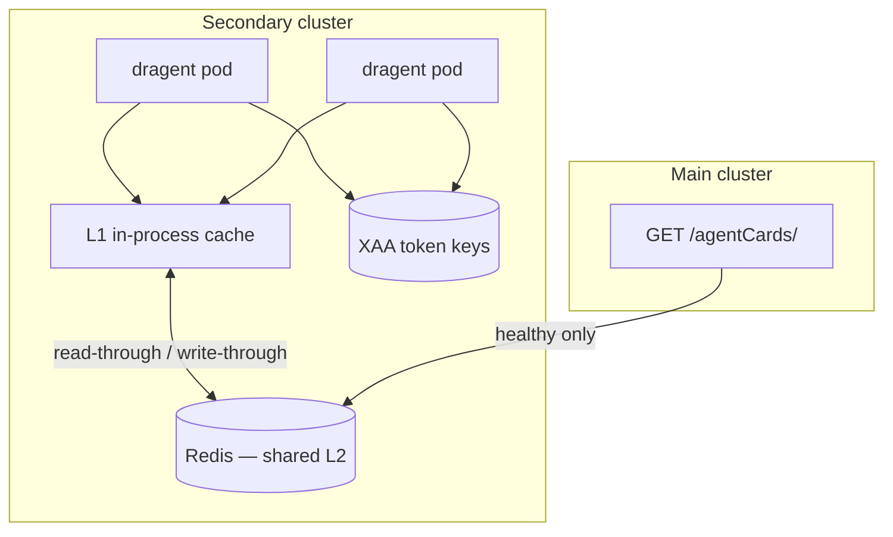

<!--
  ~ Copyright 2026 DataRobot, Inc. and its affiliates.
  ~
  ~ Licensed under the Apache License, Version 2.0 (the "License");
  ~ you may not use this file except in compliance with the License.
  ~ You may obtain a copy of the License at
  ~
  ~     http://www.apache.org/licenses/LICENSE-2.0
  ~
  ~ Unless required by applicable law or agreed to in writing, software
  ~ distributed under the License is distributed on an "AS IS" BASIS,
  ~ WITHOUT WARRANTIES OR CONDITIONS OF ANY KIND, either express or implied.
  ~ See the License for the specific language governing permissions and
  ~ limitations under the License.
-->

# Multi-cluster cache resilience design

## Problem statement

In a **multi-cluster** deployment:

| Cluster | Responsibility |
|---------|----------------|
| **Main** | User authn/authz, central agent card registry, LLM gateway, memory, OTel ingest |
| **Secondary** | Agent deployment and execution (`datarobot_genai`, agent code) |

Secondary-cluster agents must continue operating during **up to 1 hour** of main-cluster downtime for **warm workloads** (known remote agents, active user sessions, intra-secondary A2A).

Today, `datarobot_genai` has an in-process agent card registry cache (24 h TTL default) but **no shared store**, **no stale-if-error**, **no XAA token cache**, and **no startup warmup hook**. Expired registry entries or cold pods during an outage cause `AgentCardRegistryError` and degraded A2A tools.

This document specifies **what to cache**, **where**, **Redis key schema**, **environment variables**, and **code changes** in `datarobot_genai`.

## Goals and non-goals

### Goals

1. Serve registry-backed agent cards from secondary for ≥ 1 h after the last successful main-cluster fetch.
2. Share cached cards across all dragent replicas in the secondary cluster.
3. Cache XAA exchanged access tokens to reduce Okta load and latency (independent of main-cluster uptime).
4. Warm caches at startup and refresh proactively while main is healthy.
5. Expose readiness that reflects cache warmth for registry-dependent workflows.

### Non-goals (separate platform decisions)

- **LLM gateway** survivability (requires local NIM or secondary LLM endpoint).
- **Memory service** write-through / offline queue.
- **Authz policy replication** (gateway authz remains a platform concern).
- **New user sessions** through a down main gateway (requires secondary ingress).

## Architecture overview



**Read path (agent card):**

1. L1 in-process hit → return.
2. L2 Redis hit (not expired, or stale-if-error window) → populate L1 → return.
3. Fetch from main registry → write L2 + L1 → return.
4. Fetch fails → return L2 stale entry if within `AGENT_CARD_REGISTRY_MAX_STALENESS_SECONDS`.

**XAA path:** L1/L2 token cache keyed by user + target agent + scopes; Okta exchange only on miss.

## Redis schema

All keys use a configurable prefix (default `dragent:`) and optional cluster/tenant suffix for isolation.

### Agent card entries

| Key pattern | Type | Value |
|-------------|------|-------|
| `{prefix}agent_card:dep:{deployment_id}` | `STRING` (JSON) | Wrapped payload (see below) |
| `{prefix}agent_card:ext:{external_id}` | `STRING` (JSON) | Same payload (duplicate index for lookup by either ID) |

**Wrapped payload** (`AgentCardCacheRecord`):

```json
{
  "version": 1,
  "fetched_at": "2026-07-21T20:00:00Z",
  "fetched_at_mono": 1234567890.123,
  "card": { "...": "AgentCard JSON as returned by registry API" },
  "source": "registry",
  "deployment_id": "64a1b2c3...",
  "external_id": "my-remote-agent"
}
```

**Redis TTL:** `EXPIRE` = `AGENT_CARD_REGISTRY_MAX_STALENESS_SECONDS` (default `86400`). This is the **hard eviction** bound, not the soft refresh TTL.

**Indexing:** On write, set both `dep:` and `ext:` keys when the registry entry contains both IDs (mirrors in-memory `_parse_registry_response` behavior).

### Registry prefetch set (optional)

| Key pattern | Type | Purpose |
|-------------|------|---------|
| `{prefix}agent_card:pending:deployment_ids` | `SET` | IDs registered from workflow YAML across pods |
| `{prefix}agent_card:pending:external_ids` | `SET` | Same for external IDs |

Used by a startup sidecar or init container to know the union of IDs to warm. Alternative: derive IDs only from local `workflow.yaml` (simpler; no Redis set required).

### XAA exchanged token entries

| Key pattern | Type | Value |
|-------------|------|-------|
| `{prefix}xaa_token:{sha256(cache_key)}` | `STRING` (JSON) | Token record (see below) |

**Cache key material** (hashed before use in Redis key):

```
{user_id}|{target_audience}|{token_url}|{sorted_scopes_joined}|{exchange_audience}
```

**Token record:**

```json
{
  "version": 1,
  "access_token": "<secret>",
  "expires_at": "2026-07-21T20:05:00Z",
  "token_type": "Bearer"
}
```

**Redis TTL:** `EXPIRE` = `max(0, expires_at - now - AGENT_CARD_XAA_TOKEN_SKEW_SECONDS)`.

Never store `IDP_AGENT_PRIVATE_KEY_JWK` or user subject tokens in Redis.

### Distributed lock (optional, refresh job)

| Key pattern | Type | TTL |
|-------------|------|-----|
| `{prefix}agent_card:refresh_lock` | `STRING` | 60 s |

Prevents thundering herd on background refresh.

## Environment variables

### Agent card registry (existing + new)

| Variable | Default | Description |
|----------|---------|-------------|
| `DATAROBOT_API_TOKEN` | — | Registry auth (main cluster). |
| `DATAROBOT_ENDPOINT` | — | Main cluster API base (`/api/v2`). |
| `AGENT_CARD_REGISTRY_CACHE_TTL` | `86400` | **Soft TTL**: treat as fresh; skip background refresh. |
| `AGENT_CARD_REGISTRY_TIMEOUT` | `30` | HTTP timeout for registry requests. |
| `AGENT_CARD_REGISTRY_ON_DUPLICATE` | `first` | Duplicate `external_id` strategy. |
| `AGENT_CARD_REGISTRY_BACKEND` | `memory` | `memory` (today) or `redis`. |
| `AGENT_CARD_REGISTRY_REDIS_URL` | — | Required when `backend=redis`. |
| `AGENT_CARD_REGISTRY_REDIS_PREFIX` | `dragent:` | Key prefix. |
| `AGENT_CARD_REGISTRY_MAX_STALENESS_SECONDS` | `86400` | **Hard bound**: serve stale on fetch error up to this age. |
| `AGENT_CARD_REGISTRY_REFRESH_INTERVAL_SECONDS` | `1800` | Background refresh period (0 = disabled). |
| `AGENT_CARD_REGISTRY_PREFETCH_ON_STARTUP` | `true` | Call `prefetch()` for all registered IDs before ready. |
| `AGENT_CARD_REGISTRY_STALE_IF_ERROR` | `true` | Return last-known-good when main is unreachable. |

**Recommended for 1 h outage target:**

```bash
AGENT_CARD_REGISTRY_CACHE_TTL=7200              # 2 h fresh window
AGENT_CARD_REGISTRY_MAX_STALENESS_SECONDS=86400 # up to 24 h stale-if-error
AGENT_CARD_REGISTRY_BACKEND=redis
AGENT_CARD_REGISTRY_REDIS_URL=redis://cache.secondary.svc:6379/0
AGENT_CARD_REGISTRY_PREFETCH_ON_STARTUP=true
AGENT_CARD_REGISTRY_REFRESH_INTERVAL_SECONDS=1800
AGENT_CARD_REGISTRY_STALE_IF_ERROR=true
```

### XAA token cache (new)

| Variable | Default | Description |
|----------|---------|-------------|
| `AGENT_CARD_XAA_TOKEN_CACHE_ENABLED` | `true` | Enable exchanged-token cache. |
| `AGENT_CARD_XAA_TOKEN_CACHE_BACKEND` | `memory` | `memory` or `redis` (share with registry Redis). |
| `AGENT_CARD_XAA_TOKEN_SKEW_SECONDS` | `60` | Refresh token before `exp`. |
| `AGENT_CARD_XAA_TOKEN_MAX_TTL_SECONDS` | `3600` | Cap cache TTL regardless of token `exp`. |

### Secrets (replicate to secondary, not cached)

| Variable | Purpose |
|----------|---------|
| `SESSION_SECRET_KEY` | Decode `X-DataRobot-Authorization-Context` locally. |
| `IDP_AGENT_ID` | XAA client assertion `iss`/`sub`. |
| `IDP_AGENT_PRIVATE_KEY_JWK` | XAA signing key. |

### Readiness

| Variable | Default | Description |
|----------|---------|-------------|
| `DRAGENT_READINESS_REQUIRE_REGISTRY_WARM` | `false` | `/ready` fails until prefetch completes. |
| `DRAGENT_READINESS_REGISTRY_IDS` | — | Optional override list (comma-separated `dep:…` / `ext:…`). |

## Code changes

### 1. Pluggable cache backend (`agent_card_registry.py`)

Introduce a small protocol and two implementations:

```python
# datarobot_genai/dragent/agent_card_registry_backends.py

class AgentCardCacheBackend(Protocol):
    async def get(self, lookup_key: str) -> AgentCardCacheRecord | None: ...
    async def set(self, lookup_key: str, record: AgentCardCacheRecord) -> None: ...
    async def get_stale(self, lookup_key: str) -> AgentCardCacheRecord | None:
        """Return even if soft-TTL expired (for stale-if-error)."""


class MemoryAgentCardCacheBackend:
    """Current _cache dict behavior."""


class RedisAgentCardCacheBackend:
    """JSON STRING values; GET/SETEX; optional Redisson-style lock for refresh."""
```

`AgentCardRegistry` constructor selects backend from `AGENT_CARD_REGISTRY_BACKEND`.

### 2. Stale-if-error in `get()`

Extend `get()` after failed `_fetch`:

```python
async def get(self, *, deployment_id=None, external_id=None) -> AgentCard:
    lookup_key = deployment_id or external_id
    if record := await self._backend.get_fresh(lookup_key):
        return record.card

    try:
        card = await self._fetch_and_cache(lookup_key, ...)
        return card
    except AgentCardRegistryError:
        if not self._stale_if_error:
            raise
        if stale := await self._backend.get_stale(lookup_key):
            if stale.age_seconds <= self._max_staleness_seconds:
                logger.warning(
                    "Registry unreachable; serving stale agent card for %s (age=%ds)",
                    lookup_key,
                    stale.age_seconds,
                )
                return stale.card
        raise
```

**Important:** Today, TTL expiry sets `_is_cached` to false and triggers refetch. Split **soft TTL** (refresh) from **hard staleness** (serve on error).

### 3. Startup prefetch hook

New module `datarobot_genai/dragent/registry_warmup.py`:

```python
async def warmup_registry_from_config(nat_config: Config) -> None:
    """Collect all registry IDs from parsed function_groups and prefetch."""
    deployment_ids: list[str] = []
    external_ids: list[str] = []
    for fg in nat_config.function_groups.values():
        if isinstance(fg, AuthenticatedA2AClientConfig) and fg.registry:
            if fg.registry.deployment_id:
                deployment_ids.append(fg.registry.deployment_id)
            if fg.registry.external_id:
                external_ids.append(fg.registry.external_id)
    registry = await get_default_registry()
    await registry.prefetch(
        deployment_ids=deployment_ids or None,
        external_ids=external_ids or None,
    )
```

Call from `DRAgentFastApiFrontEndPluginWorker.build_app()` lifespan **before** accepting traffic when `AGENT_CARD_REGISTRY_PREFETCH_ON_STARTUP=true`.

### 4. Background refresh task

In the same lifespan:

```python
async def _registry_refresh_loop(registry: AgentCardRegistry, interval: int) -> None:
    while True:
        await asyncio.sleep(interval)
        try:
            await registry.refresh_all_registered()  # new method: re-fetch soft-expired keys
        except Exception:
            logger.exception("Background registry refresh failed")
```

`refresh_all_registered()` only fetches keys past soft TTL; failures are logged and stale entries remain.

### 5. Readiness endpoint

In `frontends/fastapi.py`, add `/ready` (distinct from `/health`):

```python
@app.get("/ready")
async def ready() -> JSONResponse:
    if os.getenv("DRAGENT_READINESS_REQUIRE_REGISTRY_WARM") == "true":
        if not registry_warmup.is_warm():
            return JSONResponse({"status": "not_ready", "reason": "registry"}, status_code=503)
    return JSONResponse({"status": "ready"})
```

Kubernetes: `livenessProbe` → `/health`; `readinessProbe` → `/ready`.

### 6. XAA token cache (`okta_a2a_auth.py`)

Wrap `get_exchanged_token()`:

```python
class XAATokenCache(Protocol):
    async def get(self, key: str) -> str | None: ...
    async def set(self, key: str, token: str, ttl_seconds: int) -> None: ...


async def get_exchanged_token(self) -> BearerTokenCred:
    cache_key = self._build_xaa_cache_key()
    if self._token_cache and (cached := await self._token_cache.get(cache_key)):
        return BearerTokenCred(token=cached)

    impl = get_token_exchange(self.config)
    exchanged = await impl.exchange_token(self._flow_params, self._extract_token())

    if self._token_cache:
        ttl = self._compute_token_ttl(exchanged)  # parse JWT exp or use max TTL cap
        await self._token_cache.set(cache_key, exchanged, ttl)

    return BearerTokenCred(token=exchanged)
```

Use the same Redis URL as registry when `AGENT_CARD_XAA_TOKEN_CACHE_BACKEND=redis`.

## Operational playbook

### Steady state (before any outage)

1. Deploy Redis (or managed cache) in the **secondary** cluster.
2. Set env vars from the recommended block above.
3. Ensure every registry-backed remote agent ID appears in `workflow.yaml` `registry:` blocks.
4. Verify `/ready` returns 200 after pod start (prefetch succeeded).
5. Confirm background refresh logs every 30 min.
6. Replicate `SESSION_SECRET_KEY` and Okta agent keys to secondary secrets.

### During main-cluster outage (≤ 1 h)

| Capability | Expected behavior |
|------------|-------------------|
| Registry-backed A2A | Works if card age &lt; `MAX_STALENESS` |
| XAA RPC | Works if Okta up + user token in headers + card cached |
| New unknown registry ID | Fails (no main registry) |
| LLM via main gateway | Fails unless secondary LLM path exists |
| OTel | Buffer locally; flush when main returns |

### After main-cluster recovery

1. Background refresh repopulates fresh cards automatically.
2. Drain OTel backlog.
3. No manual cache flush required unless cards changed during outage (then bump workflow version or call admin flush API).

## Phased rollout

| Phase | Scope | Risk |
|-------|-------|------|
| **P0** | `AGENT_CARD_REGISTRY_CACHE_TTL=7200`, startup `prefetch()` (`registry_warmup.py`), readiness gate | Low — prefetch **implemented**; readiness pending |
| **P1** | Stale-if-error in memory backend | Low — **implemented** |
| **P2** | Redis L2 backend + shared cache | Medium — **implemented** |
| **P3** | Background refresh loop | Low — **implemented** |
| **P4** | XAA token cache | Medium — handle token revocation policy |
| **P5** | Admin API: `POST /admin/registry/flush` (optional) | Low |

## Security considerations

- Redis must be **secondary-cluster private** (network policy, TLS, AUTH).
- Agent cards may contain OAuth endpoints and audiences — not highly sensitive, but tenant-scoped.
- **Never** store user Okta tokens or agent private keys in Redis.
- XAA cached tokens are bearer secrets — encrypt at rest if platform requires (Redis TLS + restricted ACL).
- Stale-if-error extends trust in old card metadata; cap `MAX_STALENESS_SECONDS` per compliance needs.

## Testing plan

| Test | Location |
|------|----------|
| Stale-if-error returns card when `_fetch` raises | `tests/dragent/test_agent_card_registry.py` |
| Soft vs hard TTL behavior | same |
| Redis backend integration (fakeredis) | new `test_agent_card_registry_redis.py` |
| Prefetch collects IDs from YAML | `tests/dragent/plugins/test_a2a_client.py` |
| XAA cache hit skips HTTP exchange | `tests/dragent/plugins/test_okta_a2a_auth.py` |
| `/ready` 503 when warm required and not warm | `tests/dragent/frontends/test_fastapi.py` |
| E2E: block registry HTTP, A2A tool still works | `e2e-tests/dragent_tests/` |

## Related documentation

- [A2A client — registry resolution](../nat/a2a-client.md)
- [A2A authentication — Okta XAA](../nat/a2a-auth.md)
- [Agent card registry implementation](../../src/datarobot_genai/dragent/agent_card_registry.py)

## Open questions

1. **Cross-cluster registry URL:** Does secondary always call main `DATAROBOT_ENDPOINT`, or is there a read replica / cache proxy?
2. **Card URL fields:** Do registry cards for secondary peers already advertise secondary `url` values, or is URL rewriting needed at cache time?
3. **Token revocation:** During outage, is serving cached XAA tokens for up to `exp` acceptable for security policy?
4. **LLM:** Is local NIM in secondary in scope for the same 1 h SLO?
