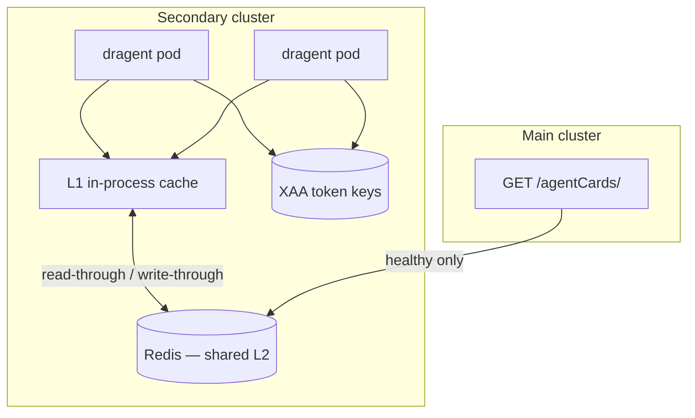

<!--
  ~ Copyright 2026 DataRobot, Inc. and its affiliates.
  ~
  ~ Licensed under the Apache License, Version 2.0 (the "License");
  ~ you may not use this file except in compliance with the License.
  ~ You may obtain a copy of the License at
  ~
  ~     http://www.apache.org/licenses/LICENSE-2.0
  ~
  ~ Unless required by applicable law or agreed to in writing, software
  ~ distributed under the License is distributed on an "AS IS" BASIS,
  ~ WITHOUT WARRANTIES OR CONDITIONS OF ANY KIND, either express or implied.
  ~ See the License for the specific language governing permissions and
  ~ limitations under the License.
-->

# Multi-cluster cache resilience design

## Problem statement

In a **multi-cluster** deployment:

| Cluster | Responsibility |
|---------|----------------|
| **Main** | User authn/authz, central agent card registry, LLM gateway, memory, OTel ingest |
| **Secondary** | Agent deployment and execution (`datarobot_genai`, agent code) |

Secondary-cluster agents must continue operating during **up to 1 hour** of main-cluster downtime for **warm workloads** (known remote agents, active user sessions, intra-secondary A2A).

Today, `datarobot_genai` has an in-process agent card registry cache (24 h TTL default) but **no shared store**, **no stale-if-error**, **no XAA token cache**, and **no startup warmup hook**. Expired registry entries or cold pods during an outage cause `AgentCardRegistryError` and degraded A2A tools.

This document specifies **what to cache**, **where**, **Redis key schema**, **environment variables**, and **code changes** in `datarobot_genai`.

## Goals and non-goals

### Goals

1. Serve registry-backed agent cards from secondary for ≥ 1 h after the last successful main-cluster fetch.
2. Share cached cards across all dragent replicas in the secondary cluster.
3. Cache XAA exchanged access tokens to reduce Okta load and latency (independent of main-cluster uptime).
4. Warm caches at startup and refresh proactively while main is healthy.
5. Expose readiness that reflects cache warmth for registry-dependent workflows.

### Non-goals (separate platform decisions)

- **LLM gateway** survivability (requires local NIM or secondary LLM endpoint).
- **Memory service** write-through / offline queue.
- **Authz policy replication** (gateway authz remains a platform concern).
- **New user sessions** through a down main gateway (requires secondary ingress).

## Architecture overview


```mermaid
flowchart TB
  subgraph main [Main cluster]
    REG[GET /agentCards/]
  end

  subgraph secondary [Secondary cluster]
    POD1[dragent pod]
    POD2[dragent pod]
    L1[L1 in-process cache]
    REDIS[(Redis — shared L2)]
    XAA_CACHE[(XAA token keys)]
    POD1 --> L1
    POD2 --> L1
    L1 <-->|read-through / write-through| REDIS
    POD1 --> XAA_CACHE
    POD2 --> XAA_CACHE
  end

  REG -->|healthy only| REDIS
```

**Read path (agent card):**

1. L1 in-process hit → return.
2. L2 Redis hit (not expired, or stale-if-error window) → populate L1 → return.
3. Fetch from main registry → write L2 + L1 → return.
4. Fetch fails → return L2 stale entry if within `AGENT_CARD_REGISTRY_MAX_STALENESS_SECONDS`.

**XAA path:** L1/L2 token cache keyed by user + target agent + scopes; Okta exchange only on miss.

## Redis schema

All keys use a configurable prefix (default `dragent:`) plus a **required per-deployment or
per-workload namespace** so co-located agent deployments sharing one Redis instance cannot
read or overwrite each other's entries. The effective key prefix is
`{AGENT_CARD_REGISTRY_REDIS_PREFIX}{kind}:{namespace}:` where `kind` is `dep`, `wl`, or
`dev` (local development only), e.g. `dragent:dep:64a1b2c3...:`.

Resolve the namespace in priority order:

1. `MLOPS_DEPLOYMENT_ID` (DataRobot custom-model deployment) — **cannot be overridden**
2. `WORKLOAD_ID` (DataRobot workload runtime) — **cannot be overridden**
3. `AGENT_CARD_REGISTRY_CACHE_NAMESPACE` (explicit; **local development only** when no platform IDs are set)

Redis backends fail at startup when no namespace can be resolved.

Redis payloads are **HMAC-SHA256 signed** with a deployment-specific secret
(`AGENT_CARD_REGISTRY_REDIS_SIGNING_KEY`, or `IDP_AGENT_PRIVATE_KEY_JWK`, or
`SESSION_SECRET_KEY`). Unsigned or tampered entries are ignored on read.

### Agent card entries

| Key pattern | Type | Value |
|-------------|------|-------|
| `{prefix}agent_card:dep:{deployment_id}` | `STRING` (JSON) | Wrapped payload (see below) |
| `{prefix}agent_card:ext:{external_id}` | `STRING` (JSON) | Same payload (duplicate index for lookup by either ID) |

**Wrapped payload** (`AgentCardCacheRecord`):

```json
{
  "version": 1,
  "fetched_at": "2026-07-21T20:00:00Z",
  "card": { "...": "AgentCard JSON as returned by registry API" },
  "source": "registry",
  "deployment_id": "64a1b2c3...",
  "external_id": "my-remote-agent"
}
```

Freshness and stale-if-error age use wall-clock `fetched_at` so TTL is meaningful
across processes (not `time.monotonic()`, which is per-process).

**Redis TTL:** `EXPIRE` = `AGENT_CARD_REGISTRY_MAX_STALENESS_SECONDS` (default `86400`). This is the **hard eviction** bound, not the soft refresh TTL.

**Indexing:** On write, set both `dep:` and `ext:` keys when the registry entry contains both IDs (mirrors in-memory `_parse_registry_response` behavior).

### Registry prefetch set (optional)

| Key pattern | Type | Purpose |
|-------------|------|---------|
| `{prefix}agent_card:pending:deployment_ids` | `SET` | IDs registered from workflow YAML across pods |
| `{prefix}agent_card:pending:external_ids` | `SET` | Same for external IDs |

Used by a startup sidecar or init container to know the union of IDs to warm. Alternative: derive IDs only from local `workflow.yaml` (simpler; no Redis set required).

### XAA exchanged token entries

| Key pattern | Type | Value |
|-------------|------|-------|
| `{prefix}xaa_token:{sha256(cache_key)}` | `STRING` (JSON) | Token record (see below) |

**Cache key material** (hashed before use in Redis key):

```
{sha256(subject_token)}|{IDP_AGENT_ID}|{target_audience}|{token_url}|{sorted_scopes_joined}|{exchange_audience}
```

**Token record:**

```json
{
  "version": 1,
  "access_token": "<secret>",
  "expires_at": "2026-07-21T20:05:00Z",
  "token_type": "Bearer"
}
```

**Redis TTL:** `EXPIRE` = `max(0, expires_at - now - AGENT_CARD_XAA_TOKEN_SKEW_SECONDS)`.

Never store `IDP_AGENT_PRIVATE_KEY_JWK` or user subject tokens in Redis.

### Distributed lock (optional, refresh job)

| Key pattern | Type | TTL |
|-------------|------|-----|
| `{prefix}agent_card:refresh_lock` | `STRING` | 60 s |

Prevents thundering herd on background refresh.

## Environment variables

### Agent card registry (existing + new)

| Variable | Default | Description |
|----------|---------|-------------|
| `DATAROBOT_API_TOKEN` | — | Registry auth (main cluster). |
| `DATAROBOT_ENDPOINT` | — | Main cluster API base (`/api/v2`). |
| `AGENT_CARD_REGISTRY_CACHE_TTL` | `86400` | **Soft TTL**: treat as fresh; skip background refresh. |
| `AGENT_CARD_REGISTRY_TIMEOUT` | `30` | HTTP timeout for registry requests. |
| `AGENT_CARD_REGISTRY_ON_DUPLICATE` | `first` | Duplicate `external_id` strategy. |
| `AGENT_CARD_REGISTRY_BACKEND` | `memory` | `memory` (today), `redis`, or `memory_space`. |
| `AGENT_CARD_REGISTRY_REDIS_URL` | — | Required when `backend=redis`. |
| `AGENT_CARD_REGISTRY_REDIS_PREFIX` | `dragent:` | Base key prefix (`dep`/`wl`/`dev` kind and namespace are appended). |
| `AGENT_CARD_REGISTRY_CACHE_NAMESPACE` | — | Local-dev-only namespace when platform IDs are unset. Ignored on hosted deployments. |
| `AGENT_CARD_REGISTRY_REDIS_SIGNING_KEY` | — | HMAC secret for Redis cache entries; falls back to `IDP_AGENT_PRIVATE_KEY_JWK` then `SESSION_SECRET_KEY`. |
| `AGENT_CARD_REGISTRY_MEMORY_SPACE_ID` | — | DataRobot MemorySpace ID when `backend=memory_space`. Defaults to `AGENT_MEMORY_SPACE_ID`. |
| `AGENT_CARD_REGISTRY_MAX_STALENESS_SECONDS` | `86400` | **Hard bound**: serve stale on fetch error up to this age. |
| `AGENT_CARD_REGISTRY_REFRESH_INTERVAL_SECONDS` | `1800` | Background refresh period (0 = disabled). |
| `AGENT_CARD_REGISTRY_PREFETCH_ON_STARTUP` | `true` | Call `prefetch()` for all registered IDs before ready. |
| `AGENT_CARD_REGISTRY_STALE_IF_ERROR` | `true` | Return last-known-good when main is unreachable. |

**Recommended for 1 h outage target:**

```bash
AGENT_CARD_REGISTRY_CACHE_TTL=7200              # 2 h fresh window
AGENT_CARD_REGISTRY_MAX_STALENESS_SECONDS=86400 # up to 24 h stale-if-error
AGENT_CARD_REGISTRY_BACKEND=redis
AGENT_CARD_REGISTRY_REDIS_URL=redis://cache.secondary.svc:6379/0
AGENT_CARD_REGISTRY_PREFETCH_ON_STARTUP=true
AGENT_CARD_REGISTRY_REFRESH_INTERVAL_SECONDS=1800
AGENT_CARD_REGISTRY_STALE_IF_ERROR=true
```

### XAA token cache (new)

| Variable | Default | Description |
|----------|---------|-------------|
| `AGENT_CARD_XAA_TOKEN_CACHE_ENABLED` | `true` | Enable exchanged-token cache. |
| `AGENT_CARD_XAA_TOKEN_CACHE_BACKEND` | `memory` | `memory`, `redis`, or `memory_space`. |
| `AGENT_CARD_XAA_TOKEN_SKEW_SECONDS` | `60` | Refresh token before `exp`. |
| `AGENT_CARD_XAA_TOKEN_MAX_TTL_SECONDS` | `3600` | Cap cache TTL regardless of token `exp`. |

### Secrets (replicate to secondary, not cached)

| Variable | Purpose |
|----------|---------|
| `SESSION_SECRET_KEY` | Decode `X-DataRobot-Authorization-Context` locally. |
| `IDP_AGENT_ID` | XAA client assertion `iss`/`sub`. |
| `IDP_AGENT_PRIVATE_KEY_JWK` | XAA signing key. |

### Readiness

| Variable | Default | Description |
|----------|---------|-------------|
| `DRAGENT_READINESS_REQUIRE_REGISTRY_WARM` | `false` | `/ready` fails until prefetch completes. |
| `DRAGENT_READINESS_REGISTRY_IDS` | — | Optional override list (comma-separated `dep:…` / `ext:…`). |

## Code changes

### 1. Pluggable cache backend (`agent_card_registry.py`)

Introduce a small protocol and two implementations:

```python
# datarobot_genai/dragent/agent_card_registry_backends.py

class AgentCardCacheBackend(Protocol):
    async def get(self, lookup_key: str) -> AgentCardCacheRecord | None: ...
    async def set(self, lookup_key: str, record: AgentCardCacheRecord) -> None: ...
    async def get_stale(self, lookup_key: str) -> AgentCardCacheRecord | None:
        """Return even if soft-TTL expired (for stale-if-error)."""


class MemoryAgentCardCacheBackend:
    """Current _cache dict behavior."""


class RedisAgentCardCacheBackend:
    """JSON STRING values; GET/SETEX; optional Redisson-style lock for refresh."""
```

`AgentCardRegistry` constructor selects backend from `AGENT_CARD_REGISTRY_BACKEND`.

### 2. Stale-if-error in `get()`

Extend `get()` after failed `_fetch`:

```python
async def get(self, *, deployment_id=None, external_id=None) -> AgentCard:
    lookup_key = deployment_id or external_id
    if record := await self._backend.get_fresh(lookup_key):
        return record.card

    try:
        card = await self._fetch_and_cache(lookup_key, ...)
        return card
    except AgentCardRegistryError:
        if not self._stale_if_error:
            raise
        if stale := await self._backend.get_stale(lookup_key):
            if stale.age_seconds <= self._max_staleness_seconds:
                logger.warning(
                    "Registry unreachable; serving stale agent card for %s (age=%ds)",
                    lookup_key,
                    stale.age_seconds,
                )
                return stale.card
        raise
```

**Important:** Today, TTL expiry sets `_is_cached` to false and triggers refetch. Split **soft TTL** (refresh) from **hard staleness** (serve on error).

### 3. Startup prefetch hook

New module `datarobot_genai/dragent/registry_warmup.py`:

```python
async def warmup_registry_from_config(nat_config: Config) -> None:
    """Collect all registry IDs from parsed function_groups and prefetch."""
    deployment_ids: list[str] = []
    external_ids: list[str] = []
    for fg in nat_config.function_groups.values():
        if isinstance(fg, AuthenticatedA2AClientConfig) and fg.registry:
            if fg.registry.deployment_id:
                deployment_ids.append(fg.registry.deployment_id)
            if fg.registry.external_id:
                external_ids.append(fg.registry.external_id)
    registry = await get_default_registry()
    await registry.prefetch(
        deployment_ids=deployment_ids or None,
        external_ids=external_ids or None,
    )
```

Call from `DRAgentFastApiFrontEndPluginWorker.build_app()` lifespan **before** accepting traffic when `AGENT_CARD_REGISTRY_PREFETCH_ON_STARTUP=true`.

### 4. Background refresh task

In the same lifespan:

```python
async def _registry_refresh_loop(registry: AgentCardRegistry, interval: int) -> None:
    while True:
        await asyncio.sleep(interval)
        try:
            await registry.refresh_all_registered()  # new method: re-fetch soft-expired keys
        except Exception:
            logger.exception("Background registry refresh failed")
```

`refresh_all_registered()` only fetches keys past soft TTL; failures are logged and stale entries remain.

### 5. Readiness endpoint

In `frontends/fastapi.py`, add `/ready` (distinct from `/health`):

```python
@app.get("/ready")
async def ready() -> JSONResponse:
    if os.getenv("DRAGENT_READINESS_REQUIRE_REGISTRY_WARM") == "true":
        if not registry_warmup.is_warm():
            return JSONResponse({"status": "not_ready", "reason": "registry"}, status_code=503)
    return JSONResponse({"status": "ready"})
```

Kubernetes: `livenessProbe` → `/health`; `readinessProbe` → `/ready`.

### 6. XAA token cache (`okta_a2a_auth.py`)

Wrap `get_exchanged_token()`:

```python
class XAATokenCache(Protocol):
    async def get(self, key: str) -> str | None: ...
    async def set(self, key: str, token: str, ttl_seconds: int) -> None: ...


async def get_exchanged_token(self) -> BearerTokenCred:
    cache_key = self._build_xaa_cache_key()
    if self._token_cache and (cached := await self._token_cache.get(cache_key)):
        return BearerTokenCred(token=cached)

    impl = get_token_exchange(self.config)
    exchanged = await impl.exchange_token(self._flow_params, self._extract_token())

    if self._token_cache:
        ttl = self._compute_token_ttl(exchanged)  # parse JWT exp or use max TTL cap
        await self._token_cache.set(cache_key, exchanged, ttl)

    return BearerTokenCred(token=exchanged)
```

Use the same Redis URL as registry when `AGENT_CARD_XAA_TOKEN_CACHE_BACKEND=redis`.

## Operational playbook

### Steady state (before any outage)

1. Deploy Redis (or managed cache) in the **secondary** cluster.
2. Set env vars from the recommended block above.
3. Ensure every registry-backed remote agent ID appears in `workflow.yaml` `registry:` blocks.
4. Verify `/ready` returns 200 after pod start (prefetch succeeded).
5. Confirm background refresh logs every 30 min.
6. Replicate `SESSION_SECRET_KEY` and Okta agent keys to secondary secrets.

### During main-cluster outage (≤ 1 h)

| Capability | Expected behavior |
|------------|-------------------|
| Registry-backed A2A | Works if card age &lt; `MAX_STALENESS` |
| XAA RPC | Works if Okta up + user token in headers + card cached |
| New unknown registry ID | Fails (no main registry) |
| LLM via main gateway | Fails unless secondary LLM path exists |
| OTel | Buffer locally; flush when main returns |

### After main-cluster recovery

1. Background refresh repopulates fresh cards automatically.
2. Drain OTel backlog.
3. No manual cache flush required unless cards changed during outage (then bump workflow version or call admin flush API).

## Phased rollout

| Phase | Scope | Risk |
|-------|-------|------|
| **P0** | `AGENT_CARD_REGISTRY_CACHE_TTL=7200`, startup `prefetch()` (`registry_warmup.py`), readiness gate | Low — prefetch **implemented**; readiness pending |
| **P1** | Stale-if-error in memory backend | Low — **implemented** |
| **P2** | Redis L2 backend + shared cache | Medium — **implemented** |
| **P3** | Background refresh loop | Low — **implemented** |
| **P4** | XAA token cache | Medium — **implemented** |
| **P5** | Admin API: `POST /admin/registry/flush` (optional) | Low |
| **P6** | MemorySpace L2 backend | Low — **implemented** |

## DataRobot MemorySpace backend (recommended for user-deployed agents)

When the platform provisions a **dedicated MemorySpace per agent deployment** (via
`AGENT_MEMORY_SPACE_ID`), set:

```bash
AGENT_CARD_REGISTRY_BACKEND=memory_space
AGENT_CARD_XAA_TOKEN_CACHE_BACKEND=memory_space
# AGENT_MEMORY_SPACE_ID injected by platform
DATAROBOT_ENDPOINT=https://app.datarobot.com/api/v2
DATAROBOT_API_TOKEN=<deployment-scoped token>
```

### Why MemorySpace satisfies platform security

| Property | Redis (shared) | MemorySpace (per deployment) |
|----------|----------------|------------------------------|
| Isolation boundary | Requires per-deployment Redis ACLs + signing keys | **Built-in** — each `memory_space_id` is unique and API access is restricted to the deploying user/workload token |
| Cross-deployment reads | Possible if ACLs fail | **Not possible** across memory spaces with stock platform auth |
| HMAC signing | Required for integrity | **Not required** — platform auth is the boundary |
| Operational overhead | Deploy and ACL-manage shared Redis | Reuse existing MemorySpace provisioning |

Cache entries are stored as **memory-service sessions** (one per cache key) with a
single ``status`` event holding the JSON payload — the same Session/event model the
agent-application recipe uses for chat history when ``USE_APPLICATION_MEMORY_SPACE``
is enabled. They do not use the mem0-compatible sub-route or conversational memory
participants.

### MemorySpace schema

Logical keys mirror the Redis layout (without a deployment namespace prefix — the memory
space itself is the isolation boundary):

| Logical key | Kind | Value |
|-------------|------|-------|
| `dep:{deployment_id}` | `agent_card` | `AgentCardCacheRecord` JSON |
| `ext:{external_id}` | `agent_card` | Same payload (duplicate index) |
| `{sha256(xaa_cache_key)}` | `xaa_token` | `XAATokenCacheRecord` JSON |

Freshness and stale-if-error use wall-clock fields inside the JSON payload (same as Redis
and in-memory backends). Session metadata records the cache key and kind; the payload
lives in a session event body.

### When to use Redis vs MemorySpace

| Scenario | Backend |
|----------|---------|
| Secondary-cluster dragent replicas with platform-managed Redis | `redis` |
| User-deployed agents on a shared multi-tenant cluster | **`memory_space`** (preferred) |
| Local development / single-process | `memory` (default) |

## Platform requirements (shared Redis)

Agent code and `datarobot_genai` are **user-modifiable before deployment**. Library-side
namespace isolation and HMAC signing are **defense in depth for stock, cooperative
deployments** (replicas of the same agent). They are **not** a security boundary against a
malicious deployer who patches the library or talks to Redis directly.

The platform **must** enforce the controls below whenever multiple independent agent
deployments share one Redis instance.

### Threat model

| Actor | Capability |
|-------|------------|
| **Benign deployment** | Runs stock dragent; benefits from namespace + signing |
| **Misconfigured deployment** | Accidentally uses wrong prefix — library + platform ID injection mitigates |
| **Malicious deployment** | Edits Python before deploy; reads env vars; can import `redis` and `SCAN`/`GET`/`SET` directly |

Assume a malicious deployment can **bypass every check implemented in this library**.

### What the library provides (not sufficient alone)

| Feature | Purpose | Limit when code is user-editable |
|---------|---------|-----------------------------------|
| `MLOPS_DEPLOYMENT_ID` / `WORKLOAD_ID` namespace | Per-deployment/workload key prefix (`dragent:dep:{id}:`) | Ignored if user patches `cache_namespace.py` |
| Reject `AGENT_CARD_REGISTRY_CACHE_NAMESPACE` override on hosted runtimes | Blocks shared tenant namespace env var | Irrelevant if user edits code |
| HMAC-SHA256 on Redis payloads | Stock dragent rejects forged/tampered entries | Does not encrypt; raw `GET` still returns plaintext JSON including `access_token` |
| XAA cache key includes `IDP_AGENT_ID` | Per-agent principal scoping in stock code | Bypassed if user edits `build_xaa_cache_key` |

### Required platform controls

#### 1. Per-deployment/workload Redis credentials (mandatory)

Do **not** inject one cluster-wide `AGENT_CARD_REGISTRY_REDIS_URL` + password into every
agent deployment. Each deployment or workload must receive credentials scoped to **its own**
key prefix only.

Example ACL pattern (Redis 6+):

```text
# User/role for deployment 64a1b2c3...
+@read +@write +@string +@keyspace ~dragent:dep:64a1b2c3:* &* -@all
```

For workloads, use `dragent:wl:{WORKLOAD_ID}:*` instead of `dep:`.

The agent process must **not** be able to `SCAN`, `KEYS`, `GET`, or `SET` outside its prefix.

#### 2. Platform-injected identity (mandatory on hosted runtimes)

| Variable | Platform responsibility |
|----------|-------------------------|
| `MLOPS_DEPLOYMENT_ID` or `WORKLOAD_ID` | Inject exactly one per deployment/workload; immutable from user config |
| `AGENT_CARD_REGISTRY_REDIS_URL` | Per-deployment URL **or** shared URL with per-deployment ACL user |
| `AGENT_CARD_REGISTRY_REDIS_SIGNING_KEY` | **Unique per deployment/workload** — do not reuse tenant-wide values |

Do **not** rely on users setting `AGENT_CARD_REGISTRY_CACHE_NAMESPACE` in production.

#### 3. Per-deployment signing secret (mandatory for Redis backends)

Inject `AGENT_CARD_REGISTRY_REDIS_SIGNING_KEY` unique to each deployment/workload.

**Do not** fall back to tenant-wide `SESSION_SECRET_KEY` for signing in multi-tenant shared
Redis — if every deployment in a tenant shares that secret, one malicious deployment can
forge valid HMACs for another deployment's key prefix (when Redis ACLs are misconfigured or
too broad).

Preferred order for the platform:

1. Dedicated `AGENT_CARD_REGISTRY_REDIS_SIGNING_KEY` per deployment (best)
2. `IDP_AGENT_PRIVATE_KEY_JWK` when it is already unique per agent deployment
3. Avoid `SESSION_SECRET_KEY` as the signing source unless it is guaranteed unique per deployment

#### 4. Network isolation (mandatory)

- Redis reachable only from agent pods (network policy), not from user-controlled egress paths outside the cluster.
- TLS in transit; restrict Redis admin interfaces.

#### 5. Sensitive data in Redis (policy)

| Data | Confidentiality | Recommendation |
|------|-----------------|----------------|
| Agent cards | Low–medium (metadata) | Redis L2 acceptable with ACLs |
| XAA exchanged tokens | **High** (bearer secrets, plaintext in JSON) | Default `AGENT_CARD_XAA_TOKEN_CACHE_BACKEND=memory`; use Redis L2 only between replicas of the **same** deployment with ACLs |

HMAC provides **integrity** for stock readers, not **confidentiality**. Anyone with read
access to a key can read the `access_token` field from the stored JSON.

#### 6. Assume deployer is root in the container

User-modifiable agent images can:

- Remove HMAC verification
- Exfiltrate tokens over HTTP instead of Redis
- Read any secret injected into that deployment's environment

Platform controls limit **cross-deployment** blast radius. They cannot stop a deployment
from exfiltrating **its own** session data.

### Platform configuration checklist

Use this when enabling `AGENT_CARD_REGISTRY_BACKEND=redis` for user-deployed agents on a
shared cluster:

- [ ] `MLOPS_DEPLOYMENT_ID` or `WORKLOAD_ID` injected by platform (not user-editable)
- [ ] Redis ACL (or equivalent) limits each deployment to `dragent:dep:{id}:*` or `dragent:wl:{id}:*`
- [ ] Unique `AGENT_CARD_REGISTRY_REDIS_SIGNING_KEY` per deployment/workload
- [ ] `SESSION_SECRET_KEY` is **not** shared as the Redis signing secret across deployments
- [ ] `AGENT_CARD_XAA_TOKEN_CACHE_BACKEND=memory` unless Redis ACLs and token risk are explicitly accepted
- [ ] Redis not reachable with cluster-wide credentials from agent containers
- [ ] Document that library namespace/signing does **not** protect against malicious code — ACLs do

### Recommended platform defaults (shared multi-tenant cluster)

```bash
# Injected by platform per deployment — not user-overridable
MLOPS_DEPLOYMENT_ID=<platform-assigned>
AGENT_CARD_REGISTRY_BACKEND=redis
AGENT_CARD_REGISTRY_REDIS_URL=redis://<acl-user>:<password>@cache.shared.svc:6379/0
AGENT_CARD_REGISTRY_REDIS_SIGNING_KEY=<unique-per-deployment-secret>

# Safer default for bearer tokens
AGENT_CARD_XAA_TOKEN_CACHE_BACKEND=memory
```

Replicas of the **same** deployment share the same injected IDs and signing key, so L2 cache
warming works. **Different** deployments get different ACL users, prefixes, and signing keys.

### What application controls cannot prevent

Even with this branch's changes, a malicious user **can** (if platform ACLs fail):

| Attack | Why library cannot stop it |
|--------|----------------------------|
| Read another deployment's Redis keys | Direct `redis` client + `GET` on plaintext JSON |
| Write garbage to another prefix | Direct `SET` if ACLs allow it |
| Forge signed entries for another deployment | Valid HMAC if signing secret is shared across deployments |
| Skip all caching/security code | Full control of deployed Python |

**Conclusion:** treat shared Redis as **untrusted across deployments** unless the platform
enforces per-deployment ACLs and unique signing material. The library optimizations target
**replica coordination and outage resilience**, not isolation from hostile co-tenants.

## Security considerations

- Redis must be **cluster-private** (network policy, TLS, AUTH). See [Platform requirements](#platform-requirements-shared-redis) for mandatory ACL and signing-key guidance when user-modifiable agents share one Redis instance. Prefer [MemorySpace backend](#datarobot-memoryspace-backend-recommended-for-user-deployed-agents) when the platform provisions per-deployment memory spaces.
- Each deployment or workload uses a distinct key prefix (`dep:` / `wl:` + platform ID). Manual `AGENT_CARD_REGISTRY_CACHE_NAMESPACE` cannot override hosted IDs.
- Agent cards may contain OAuth endpoints and audiences — not highly sensitive, but tenant-scoped.
- **Never** store user Okta tokens or agent private keys in Redis (the signing key may be derived from deployment-specific material but the key material itself is not stored in Redis).
- XAA cached tokens are bearer secrets stored as **plaintext JSON** in Redis — ACLs are required for confidentiality; HMAC only protects integrity for stock dragent readers.
- Prefer `AGENT_CARD_XAA_TOKEN_CACHE_BACKEND=memory` on shared multi-tenant Redis unless per-deployment ACLs and token-cache risk are explicitly accepted.
- Stale-if-error extends trust in old card metadata; cap `MAX_STALENESS_SECONDS` per compliance needs.
- HMAC signing helps stock dragent reject poisoned entries when the attacker lacks the victim deployment's signing secret; it does not replace Redis ACLs.

## Testing plan

| Test | Location |
|------|----------|
| Stale-if-error returns card when `_fetch` raises | `tests/dragent/test_agent_card_registry.py` |
| Soft vs hard TTL behavior | same |
| Redis backend integration (fakeredis) | new `test_agent_card_registry_redis.py` |
| Prefetch collects IDs from YAML | `tests/dragent/plugins/test_a2a_client.py` |
| XAA cache hit skips HTTP exchange | `tests/dragent/plugins/test_okta_a2a_auth.py` |
| `/ready` 503 when warm required and not warm | `tests/dragent/frontends/test_fastapi.py` |
| E2E: block registry HTTP, A2A tool still works | `e2e-tests/dragent_tests/` |

## Related documentation

- [A2A client — registry resolution](../nat/a2a-client.md)
- [A2A authentication — Okta XAA](../nat/a2a-auth.md)
- [Agent card registry implementation](../../src/datarobot_genai/dragent/agent_card_registry.py)

## Open questions

1. **Cross-cluster registry URL:** Does secondary always call main `DATAROBOT_ENDPOINT`, or is there a read replica / cache proxy?
2. **Card URL fields:** Do registry cards for secondary peers already advertise secondary `url` values, or is URL rewriting needed at cache time?
3. **Token revocation:** During outage, is serving cached XAA tokens for up to `exp` acceptable for security policy?
4. **LLM:** Is local NIM in secondary in scope for the same 1 h SLO?
